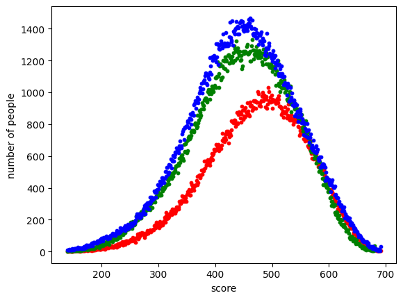
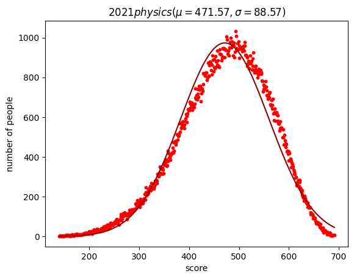
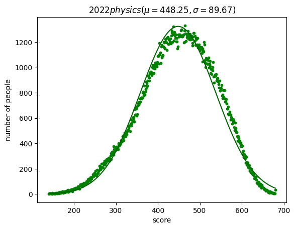
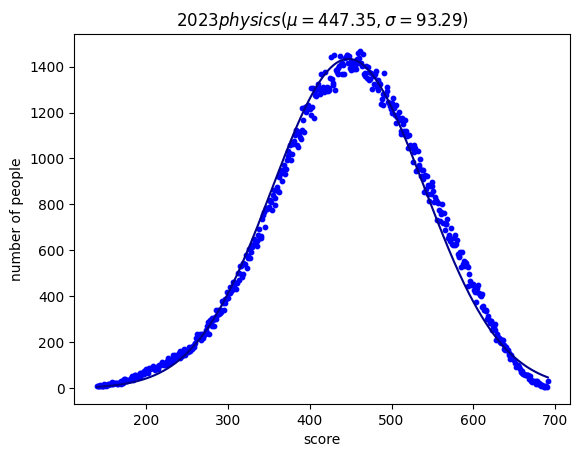
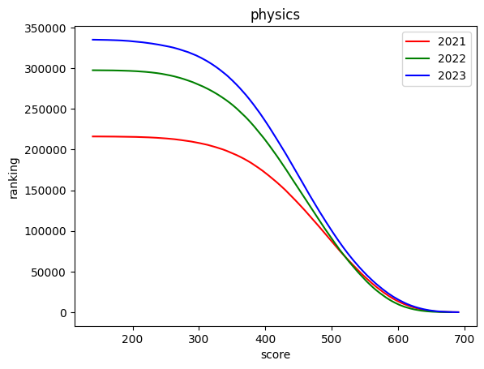
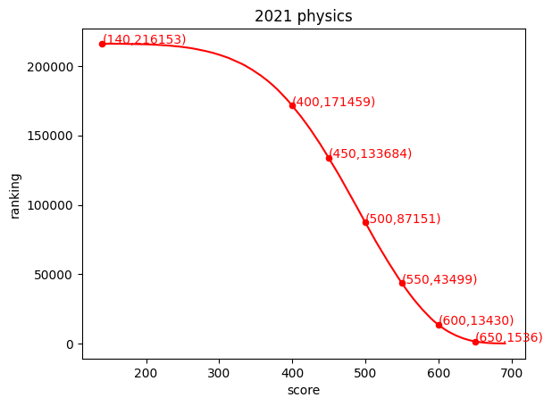
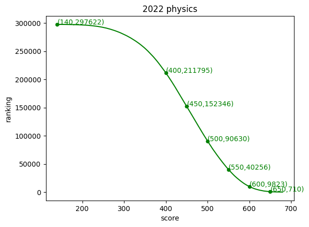
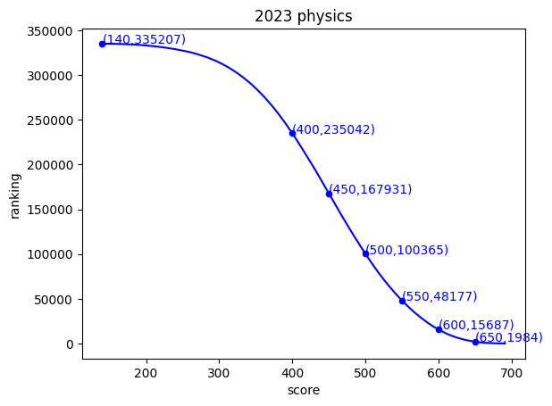

# 2021-2023年物理组合高考分数数据分析
~不要问我为啥没历史组合~
仅供参考

导入必需库


```python
import pandas as pd
import numpy as np
import matplotlib.pyplot as plt
```

数据来源
**2021: http://www.hebeea.edu.cn/html/xxgl/tzgg/2021/0624-223923-835.html**
**2022: http://www.hebeea.edu.cn/html/xxgl/tzgg/2022/0624-194133-342.html**
**2023: http://www.hebeea.edu.cn/html/xxgl/tzgg/2023/0624-205254-362.html**

读取已处理好的数据 (原文件是pdf格式 转csv格式费了好大功夫)


```python
d2021 = pd.read_csv("../data/2021.csv")
d2022 = pd.read_csv("../data/2022.csv")
d2023 = pd.read_csv("../data/2023.csv")
```

为方便 封装一个统计学方法的工具类
返回值
- year: 年份
- total: 总人数
- mu: 平均数
- sigma: 标准差

<u>wig是权重 为简便计算所求的中间量 因为此数据需加权计算<u/>


```python
class Statistics:
    def __init__(self, year, score, num):
        self.year = year
        self.total = num.sum()
        wig = num / self.total
        self.mu = (wig * score).sum()
        self.sigma = (wig * ((score - self.mu) ** 2)).sum() ** 0.5
```

获得近三年的物理组合统计学数据


```python
phy2021 = Statistics(2021, score=d2021["score"], num=d2021["physics"])
phy2022 = Statistics(2022, score=d2022["score"], num=d2022["physics"])
phy2023 = Statistics(2023, score=d2023["score"], num=d2023["physics"])
```

## 近三年物理组合 分数-人数 年份对比散点图
**红点为2021年数据**
**绿点为2022年数据**
**蓝点为2023年数据**


```python
plt.scatter(x=d2021["score"], y=d2021["physics"], s=10, c="r")
plt.scatter(x=d2022["score"], y=d2022["physics"], s=10, c="g")
plt.scatter(x=d2023["score"], y=d2023["physics"], s=10, c="b")
plt.xlabel("score")
plt.ylabel("number of people")
plt.show()
```


    

    


可以明显看出此散点图大致符合正态分布
故计算 $\mu$ 平均数 和 $\sigma$ 标准差 并结合正态分布函数可得出正态分布拟合曲线

正态分布函数


```python
def normal_dis(x, mu, sigma):
    return 0.3989422804014327 / sigma * np.exp(- (x - mu) ** 2 / (2 * sigma ** 2))
```

俗话说提高一分, 干掉千人 到底有没有道理呢? 我们用数据说话
数据在图下方 为合乎直觉 我取 取得某分数的人数大于950人 作为干掉千人的标准

### 用正态分布拟合的2021年物理组合 分数-人数 分布图


```python
plt.scatter(x=d2021["score"], y=d2021["physics"], s=10, c="red")
plt.plot(d2021["score"], normal_dis(d2021["score"], phy2021.mu, phy2021.sigma) * phy2021.total, c="darkred")
plt.xlabel("score")
plt.ylabel("number of people")
plt.title(f"${phy2021.year}physics (\\mu={phy2021.mu:.2f}, \\sigma={phy2021.sigma:.2f}) $")
plt.show()
```


    

    


```python
num = d2021[["score", "physics"]][d2021["physics"] >= 950]
print(f"min={num["score"].min()}, max={num["score"].max()}")
num
```

    min=475, max=512
    


<div>
<style scoped>
    .dataframe tbody tr th:only-of-type {
        vertical-align: middle;
    }

    .dataframe tbody tr th {
        vertical-align: top;
    }

    .dataframe thead th {
        text-align: right;
    }
</style>
<table border="1" class="dataframe">
  <thead>
    <tr style="text-align: right;">
      <th></th>
      <th>score</th>
      <th>physics</th>
    </tr>
  </thead>
  <tbody>
    <tr>
      <th>179</th>
      <td>512</td>
      <td>977</td>
    </tr>
    <tr>
      <th>180</th>
      <td>511</td>
      <td>958</td>
    </tr>
    <tr>
      <th>182</th>
      <td>509</td>
      <td>960</td>
    </tr>
    <tr>
      <th>185</th>
      <td>506</td>
      <td>950</td>
    </tr>
    <tr>
      <th>187</th>
      <td>504</td>
      <td>950</td>
    </tr>
    <tr>
      <th>188</th>
      <td>503</td>
      <td>954</td>
    </tr>
    <tr>
      <th>190</th>
      <td>501</td>
      <td>959</td>
    </tr>
    <tr>
      <th>192</th>
      <td>499</td>
      <td>981</td>
    </tr>
    <tr>
      <th>194</th>
      <td>497</td>
      <td>972</td>
    </tr>
    <tr>
      <th>196</th>
      <td>495</td>
      <td>1007</td>
    </tr>
    <tr>
      <th>198</th>
      <td>493</td>
      <td>1033</td>
    </tr>
    <tr>
      <th>201</th>
      <td>490</td>
      <td>973</td>
    </tr>
    <tr>
      <th>202</th>
      <td>489</td>
      <td>958</td>
    </tr>
    <tr>
      <th>204</th>
      <td>487</td>
      <td>961</td>
    </tr>
    <tr>
      <th>205</th>
      <td>486</td>
      <td>982</td>
    </tr>
    <tr>
      <th>206</th>
      <td>485</td>
      <td>950</td>
    </tr>
    <tr>
      <th>207</th>
      <td>484</td>
      <td>976</td>
    </tr>
    <tr>
      <th>208</th>
      <td>483</td>
      <td>999</td>
    </tr>
    <tr>
      <th>209</th>
      <td>482</td>
      <td>977</td>
    </tr>
    <tr>
      <th>210</th>
      <td>481</td>
      <td>950</td>
    </tr>
    <tr>
      <th>215</th>
      <td>476</td>
      <td>991</td>
    </tr>
    <tr>
      <th>216</th>
      <td>475</td>
      <td>1006</td>
    </tr>
  </tbody>
</table>
</div>


共22个分数符合要求, 其中最低分数为475, 最高分数为512

### 用正态分布拟合的2022年物理组合 分数-人数 分布图


```python
plt.scatter(x=d2022["score"], y=d2022["physics"], s=10, c="green")
plt.plot(d2022["score"], normal_dis(d2022["score"], phy2022.mu, phy2022.sigma) * phy2022.total, c="darkgreen")
plt.xlabel("score")
plt.ylabel("number of people")
plt.title(f"${phy2022.year}physics (\\mu={phy2022.mu:.2f}, \\sigma={phy2022.sigma:.2f})$")
plt.show()

```


    

    


```python
num = d2022[["score", "physics"]][d2022["physics"] >= 950]
print(f"min={num["score"].min()}, max={num["score"].max()}")
num
```

    min=381, max=532
    


<div>
<style scoped>
    .dataframe tbody tr th:only-of-type {
        vertical-align: middle;
    }

    .dataframe tbody tr th {
        vertical-align: top;
    }

    .dataframe thead th {
        text-align: right;
    }
</style>
<table border="1" class="dataframe">
  <thead>
    <tr style="text-align: right;">
      <th></th>
      <th>score</th>
      <th>physics</th>
    </tr>
  </thead>
  <tbody>
    <tr>
      <th>148</th>
      <td>532</td>
      <td>1040</td>
    </tr>
    <tr>
      <th>149</th>
      <td>531</td>
      <td>1004</td>
    </tr>
    <tr>
      <th>150</th>
      <td>530</td>
      <td>974</td>
    </tr>
    <tr>
      <th>151</th>
      <td>529</td>
      <td>986</td>
    </tr>
    <tr>
      <th>153</th>
      <td>527</td>
      <td>985</td>
    </tr>
    <tr>
      <th>...</th>
      <td>...</td>
      <td>...</td>
    </tr>
    <tr>
      <th>293</th>
      <td>387</td>
      <td>1003</td>
    </tr>
    <tr>
      <th>296</th>
      <td>384</td>
      <td>963</td>
    </tr>
    <tr>
      <th>297</th>
      <td>383</td>
      <td>965</td>
    </tr>
    <tr>
      <th>298</th>
      <td>382</td>
      <td>961</td>
    </tr>
    <tr>
      <th>299</th>
      <td>381</td>
      <td>952</td>
    </tr>
  </tbody>
</table>
<p>149 rows × 2 columns</p>
</div>


共149个分数符合要求, 其中最低分数为381, 最高分数为532

### 用正态分布拟合的2023年物理组合 分数-人数 分布图


```python
plt.scatter(x=d2023["score"], y=d2023["physics"], s=10, c="blue")
plt.plot(d2023["score"], normal_dis(d2023["score"], phy2023.mu, phy2023.sigma) * phy2023.total, c="darkblue")
plt.xlabel("score")
plt.ylabel("number of people")
plt.title(f"${phy2023.year}physics (\\mu={phy2023.mu:.2f}, \\sigma={phy2023.sigma:.2f}) $")
plt.show()
```


    

    


```python
num = d2023[["score", "physics"]][d2023["physics"] >= 950]
print(f"min={num["score"].min()}, max={num["score"].max()}")
num
```

    min=365, max=538
    


<div>
<style scoped>
    .dataframe tbody tr th:only-of-type {
        vertical-align: middle;
    }

    .dataframe tbody tr th {
        vertical-align: top;
    }

    .dataframe thead th {
        text-align: right;
    }
</style>
<table border="1" class="dataframe">
  <thead>
    <tr style="text-align: right;">
      <th></th>
      <th>score</th>
      <th>physics</th>
    </tr>
  </thead>
  <tbody>
    <tr>
      <th>153</th>
      <td>538</td>
      <td>951</td>
    </tr>
    <tr>
      <th>154</th>
      <td>537</td>
      <td>950</td>
    </tr>
    <tr>
      <th>156</th>
      <td>535</td>
      <td>998</td>
    </tr>
    <tr>
      <th>157</th>
      <td>534</td>
      <td>962</td>
    </tr>
    <tr>
      <th>158</th>
      <td>533</td>
      <td>971</td>
    </tr>
    <tr>
      <th>...</th>
      <td>...</td>
      <td>...</td>
    </tr>
    <tr>
      <th>319</th>
      <td>372</td>
      <td>995</td>
    </tr>
    <tr>
      <th>320</th>
      <td>371</td>
      <td>955</td>
    </tr>
    <tr>
      <th>322</th>
      <td>369</td>
      <td>972</td>
    </tr>
    <tr>
      <th>323</th>
      <td>368</td>
      <td>951</td>
    </tr>
    <tr>
      <th>326</th>
      <td>365</td>
      <td>950</td>
    </tr>
  </tbody>
</table>
<p>168 rows × 2 columns</p>
</div>


共168个分数符合要求, 其中最低分数为365, 最高分数为538

可以看出21年平均数明显高于后两年 标准差较小 推测21年试题难度较小且中档题占比较大
23年标准差明显高于前两年 平均数最低 推测23年试题难度较大且难题占比较大
通过数据可以看出 分数大致在360到540之间 提高一分, 干掉千人不无道理

## 接下来是物理组合 分数-排名 年份对比折线图
<u>用散点图锯齿明显 影响美观; 此数据分布较规律 类似反正切函数 但我不会拟合函数 :) <u/>
折线图好弄图例


```python
plt.plot(d2021["score"], d2021["p-ranking"], c="r", label="2021")
plt.plot(d2022["score"], d2022["p-ranking"], c="g", label="2022")
plt.plot(d2023["score"], d2023["p-ranking"], c="b", label="2023")
plt.legend()
plt.xlabel("score")
plt.ylabel("ranking")
plt.title("physics")
plt.show()
```


    

    


曲线纵截距(有记录的最低分为140)为参加高考的物理组合总人数
可以看到在逐年递增~废话~

为方便先定义一个工具类


```python
# 根据分数获得排名
class GetRanking:
    def __init__(self, score, num_rank, min_ranking=140):
        self.score = score
        self.rank_i = num_rank.shape[0] - score + min_ranking - 1
        self.ranking = num_rank[self.rank_i]

    def plot_point(self, c):
        plt.scatter(x=self.score, y=self.ranking, s=50, c=c)
        plt.text(x=self.score, y=self.ranking, s=f"({self.score},{self.ranking})", c=c)

```

### 2021年物理组合 分数-排名 折线图


```python
plt.plot(d2021["score"], d2021["p-ranking"], c="r", label="2021")
r140 = GetRanking(140, d2021["p-ranking"])
r140.plot_point("r")
for i in range(400, 651, 50):
    r = GetRanking(i, d2021["p-ranking"])
    r.plot_point("r")
plt.xlabel("score")
plt.ylabel("ranking")
plt.title("2021 physics")
plt.show()
```


    

    


### 2022年物理组合 分数-排名 折线图


```python
plt.plot(d2022["score"], d2022["p-ranking"], c="g", label="2022")
r140 = GetRanking(140, d2022["p-ranking"])
r140.plot_point("g")
for i in range(400, 651, 50):
    r = GetRanking(i, d2022["p-ranking"])
    r.plot_point("g")
plt.xlabel("score")
plt.ylabel("ranking")
plt.title("2022 physics")
plt.show()
```


    

    


### 2023年物理组合 分数-排名 折线图


```python
plt.plot(d2023["score"], d2023["p-ranking"], c="b", label="2023")
r140 = GetRanking(140, d2023["p-ranking"])
r140.plot_point("b")
for i in range(400, 651, 50):
    r = GetRanking(i, d2023["p-ranking"])
    r.plot_point("b")
plt.xlabel("score")
plt.ylabel("ranking")
plt.title("2023 physics")
plt.show()
```


    

    


不要吐槽配色很丑 用的三原色rgb配色

# 以上
